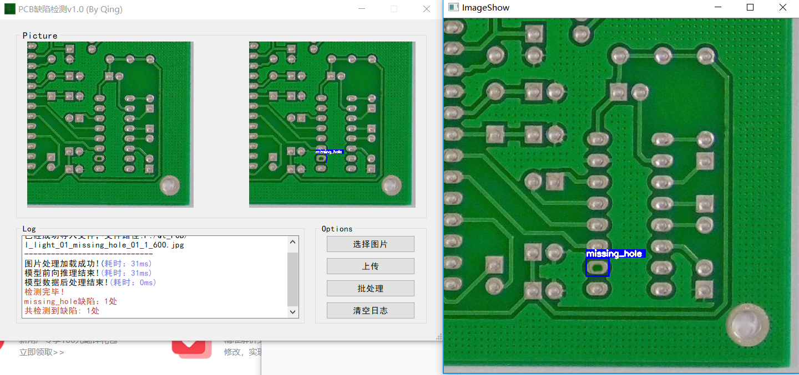
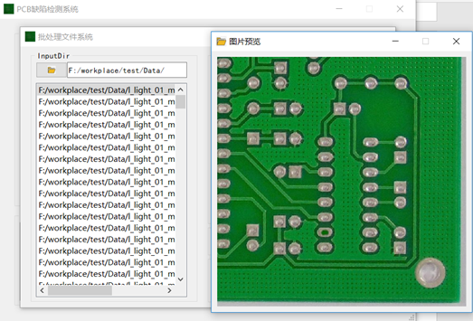
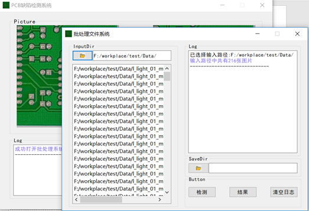
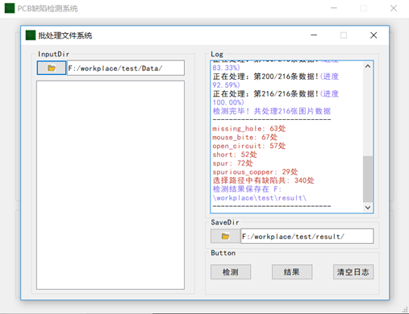

# Easy_PCB_App

PCB Defect Detection

A PCB defect detection application deployed using the QT and OnnxRuntime framework.

* Use C++ for deep learning model deployment.
* Use QT for application development.
* Model deployment is implemented using the OnnxRuntime framework.
* We use PKU-Market-PCB datasets.

## Install

* clone the project by ```git clone https://github.com/StudentKang/Easy_PCB_App.git```
* Use it by clicking ```QT_PCB.exe```.

## introduction

* The defect detection for a single PCB defect picture. Displays detection speed, defect category, and the number of corresponding defect.



* Click PCB sample picture to preview the picture.



* The defect detection for batch PCB defect pictures. Displays defect processing progress and batch defect sample number.




